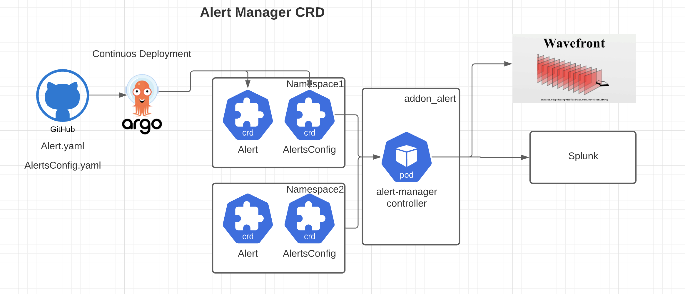

# alert-manager

[][GithubMaintainedUrl]
[][GithubPrsUrl]
[][SlackUrl]

[![Release][ReleaseImg]][ReleaseUrl]
[![Build Status][BuildStatusImg]][BuildMasterUrl]
[![codecov][CodecovImg]][CodecovUrl]
[![Go Report Card][GoReportImg]][GoReportUrl]

A Kubernetes operator that enables management of monitoring alerts as custom resources within your Kubernetes clusters.

## Table of Contents
- [Overview](#overview)
- [Requirements](#requirements)
- [Features](#features)
- [Architecture](#architecture)
- [Quick Start](#quick-start)
- [Usage](#usage)
- [Documentation](#documentation)
- [Version Compatibility](#version-compatibility)
- [Contributing](#contributing)

## Overview

alert-manager enables you to define and manage monitoring alerts as Kubernetes resources, allowing you to:

- Create alerts alongside your application deployments
- Version control your alert definitions
- Apply GitOps practices to your monitoring configuration
- Scale efficiently with templated alerts

Currently supported monitoring backends include:
- Wavefront
- Splunk (Phase 2)

## Requirements

- Kubernetes cluster v1.16+
- kubectl configured with admin access
- For Wavefront alerts: A Wavefront account and API token
- Reliable connectivity to your monitoring backend systems

## Features

- **Declarative alert management** - Define alerts using Kubernetes custom resources
- **Multiple monitoring systems** - Support for different monitoring backends
- **Templating** - Create reusable alert templates across applications
- **Scalable** - AlertsConfig allows efficient alert management without etcd bloat
- **GitOps compatible** - Manage alerts through the same pipeline as your applications

## Architecture



alert-manager follows a Kubernetes operator pattern that watches for custom resources and reconciles them with the target monitoring systems.

For a more detailed view of the architecture including component interactions and workflows, see the [Architecture Documentation](docs/architecture.md).

## Quick Start

To get started with alert-manager:

1. Clone the repository:
   ```bash
   git clone https://github.com/keikoproj/alert-manager.git
   cd alert-manager
   ```

2. Use the installation script to deploy alert-manager:
   ```bash
   # Install with the provided script (recommended)
   ./hack/install.sh <namespace> <monitoring_backend_url> <api_token>
   
   # Example:
   ./hack/install.sh alert-manager-system wavefront.example.com my-api-token
   ```

Alternatively, you can install manually:

1. Create a Secret with your monitoring system credentials:
   ```bash
   # Example for Wavefront
   kubectl apply -f docs/sample-secret.yaml
   ```

2. Deploy the controller and CRDs:
   ```bash
   make deploy
   ```

For detailed installation instructions, configuration options, and prerequisites, see the [Quick Start Guide](docs/quickstart.md).

## Usage

Here's a simple example of a WavefrontAlert:

```yaml
apiVersion: alertmanager.keikoproj.io/v1alpha1
kind: WavefrontAlert
metadata:
  name: cpu-high-alert
spec:
  alertType: CLASSIC
  alertName: high-cpu-usage
  condition: ts("kubernetes.node.cpu.usage") > 80
  minutes: 5
  resolveAfterMinutes: 5
  severity: warn
  tags:
    - kubernetes
    - cpu
```

For more examples and detailed usage information, see the [Quick Start Guide](docs/quickstart.md).

## Documentation

- [Architecture Documentation](docs/architecture.md)
- [Quick Start Guide](docs/quickstart.md)
- [Configuration Options](docs/configmap-properties.md)
- [Developer Guide](docs/developer-guide.md)
- [Troubleshooting Guide](docs/troubleshooting.md)

## Version Compatibility

| alert-manager Version | Kubernetes Version | Notable Features | Go Version |
|-----------------------|--------------------|------------------|------------|
| current (master)      | 1.28+              | Go 1.24 upgrade  | 1.24+      |
| v0.5.0                | 1.22+              | Improved scalability, enhanced status reporting | 1.19+ |
| v0.4.0                | 1.20 - 1.24        | Template alerting, Splunk integration (beta) | 1.18+ | 
| v0.3.0                | 1.18 - 1.22        | Multi-cluster support, alert batching | 1.16+ |
| v0.2.0                | 1.16 - 1.20        | Initial AlertsConfig implementation | 1.15+ |
| v0.1.0                | 1.16+              | Initial release with Wavefront support | 1.13+ |

For detailed information about each release, see the [GitHub Releases page](https://github.com/keikoproj/alert-manager/releases).

## Contributing

Please see [CONTRIBUTING.md](CONTRIBUTING.md).

## License

Apache License 2.0, see [LICENSE](LICENSE).

<!-- Markdown link -->
[GithubMaintainedUrl]: https://github.com/keikoproj/alert-manager/graphs/commit-activity
[GithubPrsUrl]: https://github.com/keikoproj/alert-manager/pulls
[SlackUrl]: https://keikoproj.slack.com/messages/alert-manager

[ReleaseImg]: https://img.shields.io/github/release/keikoproj/alert-manager.svg
[ReleaseUrl]: https://github.com/keikoproj/alert-manager/releases/latest

[BuildStatusImg]: https://github.com/keikoproj/alert-manager/actions/workflows/unit_test.yaml/badge.svg
[BuildMasterUrl]: https://github.com/keikoproj/alert-manager/actions/workflows/unit_test.yaml

[CodecovImg]: https://codecov.io/gh/keikoproj/alert-manager/branch/master/graph/badge.svg
[CodecovUrl]: https://codecov.io/gh/keikoproj/alert-manager

[GoReportImg]: https://goreportcard.com/badge/github.com/keikoproj/alert-manager
[GoReportUrl]: https://goreportcard.com/report/github.com/keikoproj/alert-manager
