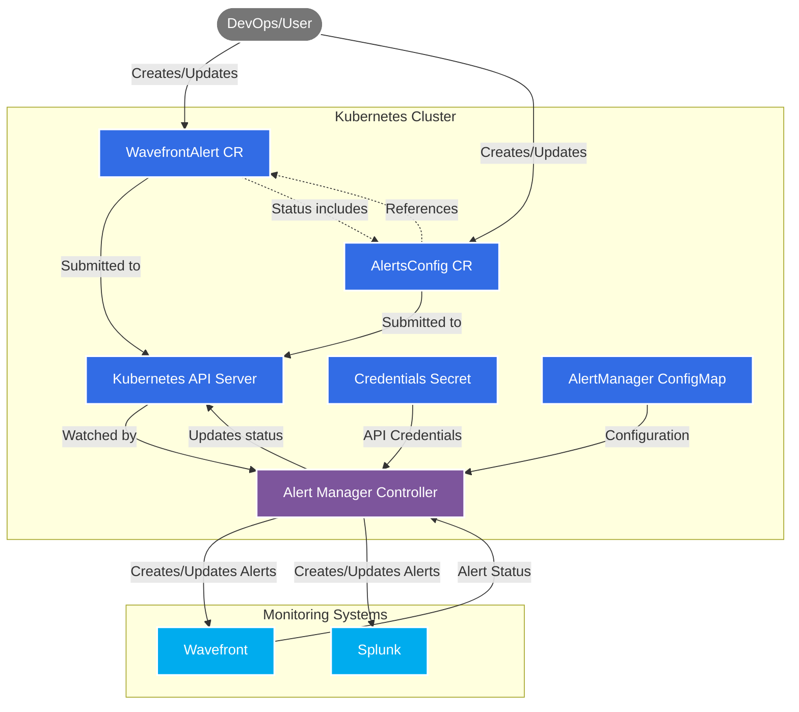
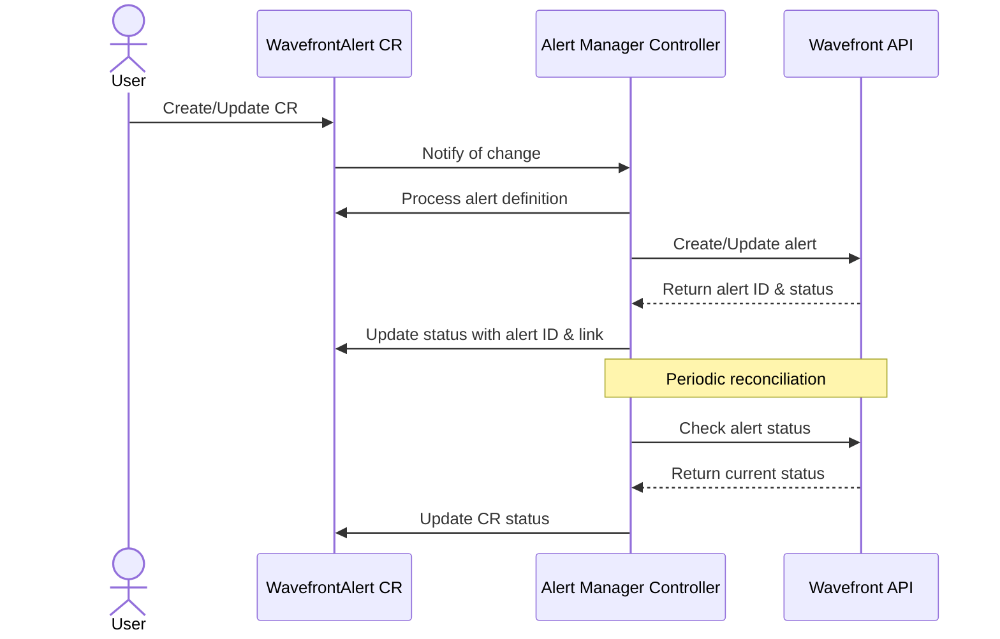
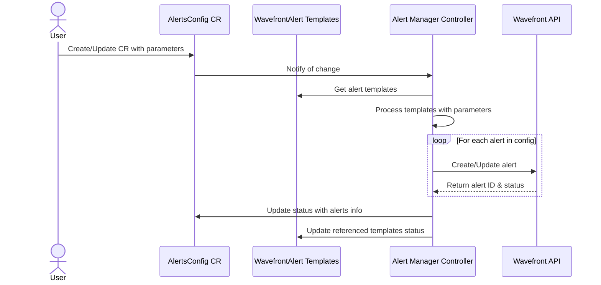

# Alert Manager Architecture

This document describes the architecture of alert-manager, a Kubernetes operator that enables management of monitoring alerts as custom resources within Kubernetes clusters.

## Overview

alert-manager follows the Kubernetes operator pattern, watching for custom resources that define alerts and reconciling them with monitoring systems like Wavefront. It enables a GitOps approach to alert management, allowing alerts to be version-controlled and deployed alongside applications.

## Architecture Diagram

## Component Interactions

### WavefrontAlert Flow

### AlertsConfig Flow

## Key Components

### 1. Custom Resource Definitions (CRDs)

#### WavefrontAlert CRD
Defines a specific alert in Wavefront with:
- Alert name and conditions
- Notification targets
- Severity
- Display expressions
- Tags

#### AlertsConfig CRD
Allows efficient management of multiple similar alerts by:
- Referencing alert templates (WavefrontAlert CRs)
- Providing parameters to customize the templates
- Enabling/disabling specific alerts
- Overriding default template values

### 2. Alert Manager Controller

The controller:
- Watches for changes to alert-related CRs
- Reconciles the desired state (CRs) with the actual state (monitoring systems)
- Manages the lifecycle of alerts in monitoring systems
- Updates CR status with current alert information
- Handles error conditions and retries

### 3. Monitoring System Integrations

Currently supports:
- **Wavefront**: Complete implementation
- **Splunk**: Planned for future release

## Scalability Design

The AlertsConfig approach addresses a key scalability concern:

Traditional approach: 1 alert type × 100 applications = 100 CRs  
Alert-manager approach: 1 AlertsConfig per application = 1 CR

For large environments (e.g., 450 applications with 100 alert types):
- Traditional approach: 45,000 CRs (risk of etcd overload)
- Alert-manager approach: 450 CRs (manageable)

## Security Considerations

- Controller requires API credentials for monitoring systems
- Credentials stored as Kubernetes Secrets
- RBAC controls who can create/modify alert resources
- Namespace-scoped resources allow isolation between teams

## Configuration

The alert-manager is configured through a ConfigMap which defines:
- Monitoring system endpoints
- Default settings
- Retry parameters
- Logging levels
