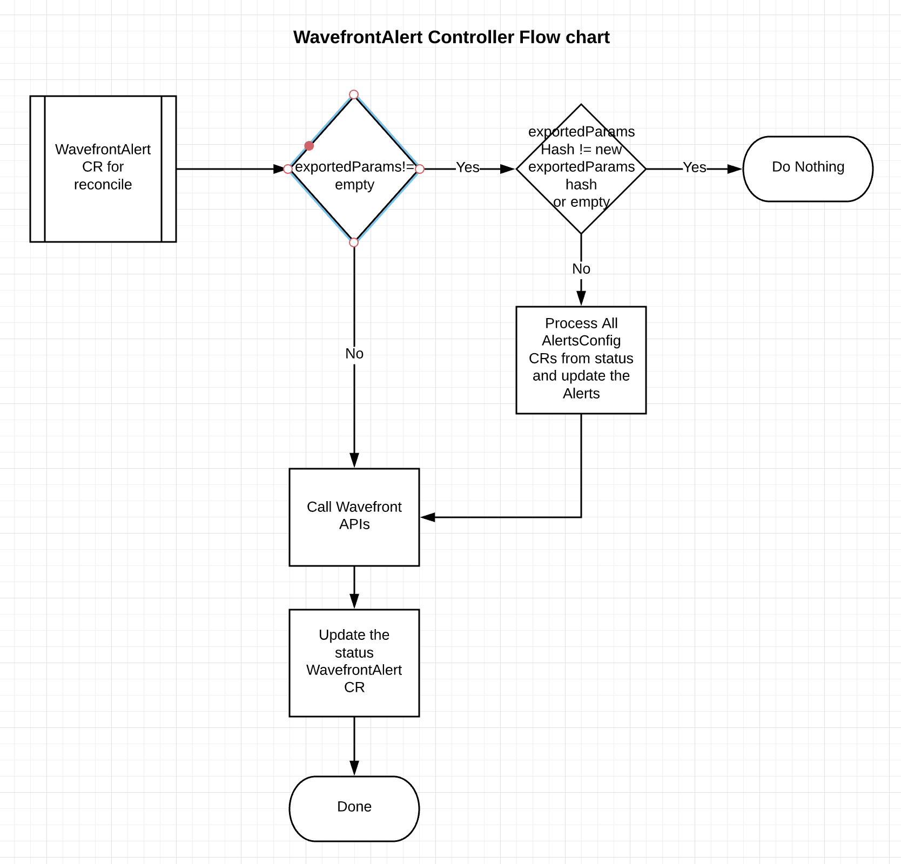
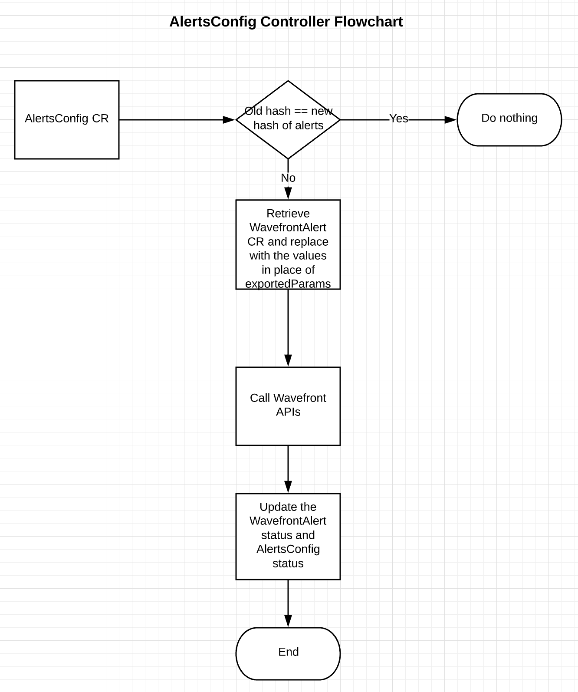

## High Level Design

### WavefrontAlert Controller

WavefrontAlert controller responsibility must be to create/update/delete wavefront alerts by making an api call to Wavefront using wavefront rest apis.
This should be very simple and should be able to do Wavefront CRUD operation. 

Usecase 1: Stand Alone WavefrontAlert- Should be simple and  handle CRUD operations.
Usecase 2: Simple stand alone wavefront alerts can be used for small scale alert setup but if you have a use case where same wavefront alert type needs to be
created for multiple applications (for example: api request count) with slight changes, we might be looking at large number of CRs which might
cause space issues in etcd and also other latency issues. For example, 100 alerts for 450 applications/clusters could result in 45000 CRs
if we want to maintain 1:1 relationship for an alert.

To avoid this problem, introducing new CRD “AlertsConfig” which can represent multiple alert configurations in a single CR

AlertsConfig CRD represents the alert configuration and can be used to represent multiple alerts in a single CR.
This can be used per application/cluster to represent all the alerts specific to that cluster.
This changes the total number of CRs to represent cluster alert management to 100 + 450 = 550 in above example.

Simplest usage is, we parameterize application name using go template in WavefrontAlert and pass that value in AlertsConfig CR.

WavefrontAlerts Controller should provide 
1. Allow option to provide default values for the exportedParams
2. Should update the status in WavefrontAlert CR along with AlertsConfig CR information

In this case, WavefrontAlert controller should handle some design changes. 
i.e, 
1. If the request doesn't have any exportParams, consider it as stand also wavefront alert and perform CRUD operations.
2. If the request have exportParams
   a. compare the previous exportedParams hash from the status with newly created exportedParams hash and if there is a difference do nothing
   b. If there is no difference, which means change happened in "non exportedParams" section so controller should take care of updating all existing WavefrontAlerts.

Sample High Level Flow chart

### AlertsConfig Controller

AlertsConfig controller is an optional and will be used only if usecase 2 from WavefrontAlert controller section is applicable.
By default, AlertsConfig controller can not do anything other than providing substitution values if a WavefrontAlert CR has been templatized.
AlertsConfig controller should be created in a such a way that it can support multiple type of Alerts for example WavefrontAlerts, SplunkAlerts etc.,

AlertConfig Controller should provide
1. Global Variable support - If a particular value is needed more than one individual config section we should provide a way to provide the default global variable instead of user providing the value in each individual sections
2. Global GVK - Similar to substitution field values CRD should provide a way for users to provide GVK in global sections if its needed in more than one individual config sub sections
3. Update the Alert information to the CR

High Level flow chart

